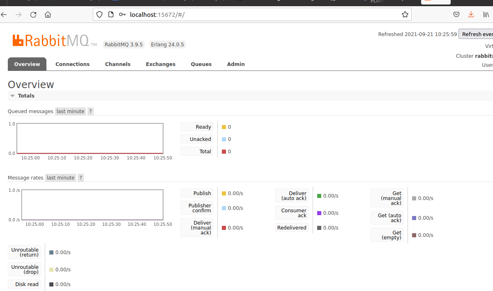

### Ravn Challenge Backend

## Description

Simple API endpoint that returns the list of the top authors

<!-- TABLE OF CONTENTS -->
<details open="open">
  <summary><h2 style="display: inline-block">Table of Contents</h2></summary>
  <ol>
    <li>
      <a href="#about-the-project">About The Project</a>
      <ul>
        <li><a href="#built-with">Built With</a></li>
      </ul>
    </li>
    <li>
      <a href="#getting-started">Getting Started</a>
      <ul>
        <li><a href="#prerequisites">Prerequisites</a></li>
        <li><a href="#installation">Installation</a></li>
      </ul>
    </li>
    <li><a href="#usage">Usage</a></li>
    <li><a href="#license">License</a></li>
    <li><a href="#contact">Contact</a></li>
    <li><a href="#acknowledgements">Acknowledgements</a></li>
  </ol>
</details>


<!-- ABOUT THE PROJECT -->
## About The Project

Project developed as a challengue for RAVN.


### Built With

* [Golang](https://golang.org/)
* [Postgres](https://www.postgresql.org/)
* [RabbitMQ](https://www.rabbitmq.com/)
* [Gin-Conic](https://github.com/gin-gonic/gin)
* [Docker](https://www.docker.com/)


<!-- GETTING STARTED -->
## Getting Started

To get a local copy up and running follow these simple steps.

### Prerequisites

This is an example of how to list things you need to use the software and how to install them.

* git
* docker
  
### Config

Information related to Config credentials for Database and MessageBroker (RabbitMQ) are storage in `build` directory.

Script for the database is storage in `scripts` directory.

### Installation

1. Clone the repo
   ```sh
   git clone https://github.com/jainor/Ravn-Challenge-Backend-jainor
   ```
2. Build containers
   ```sh
   docker-compose build
   ```
3. Running containers
   ```sh
   docker-compose up
   ```

<!-- USAGE EXAMPLES -->
## Usage

Once the generated images are running we hace 3 different services running

1. Database
2. MessageBroker (Rabbit)
3. API endpoint (Publish messages and receives query results via RPC callbacks)
4. Workers (Consuming messages) 

To access psql inside Database container
   ```sh
   docker ps
   docker exec -it <container_id_for_db>  psql -U <user> -w <database_name>
   ```

To monitor Messagebroker (GUI) open `http://localhost:15672` in the browser and use guest (docker-compose config) as user and password 




To use the Api endpoint, execute

 ```sh
   curl localhost:8080/authors?count=<number>
   ```

The Kubernets' part is currently under development


<!-- LICENSE -->
## License

Distributed under the Mozilla Public License. See `LICENSE` for more information.


<!-- CONTACT -->
## Contact

Jainor Cardenas - jainorcardenas@gmail.com

Project Link: [https://github.com/jainor/Ravn-Challenge-Backend-jainor](https://github.com/jainor/Ravn-Challenge-Backend-jainor)


<!-- ACKNOWLEDGEMENTS -->
## Acknowledgements

* [Golang spec](https://golang.org/ref/spec)
* [RabbitMQ tutorials](https://www.rabbitmq.com/getstarted.html)
* [Docker Reference](https://docs.docker.com/reference/)

